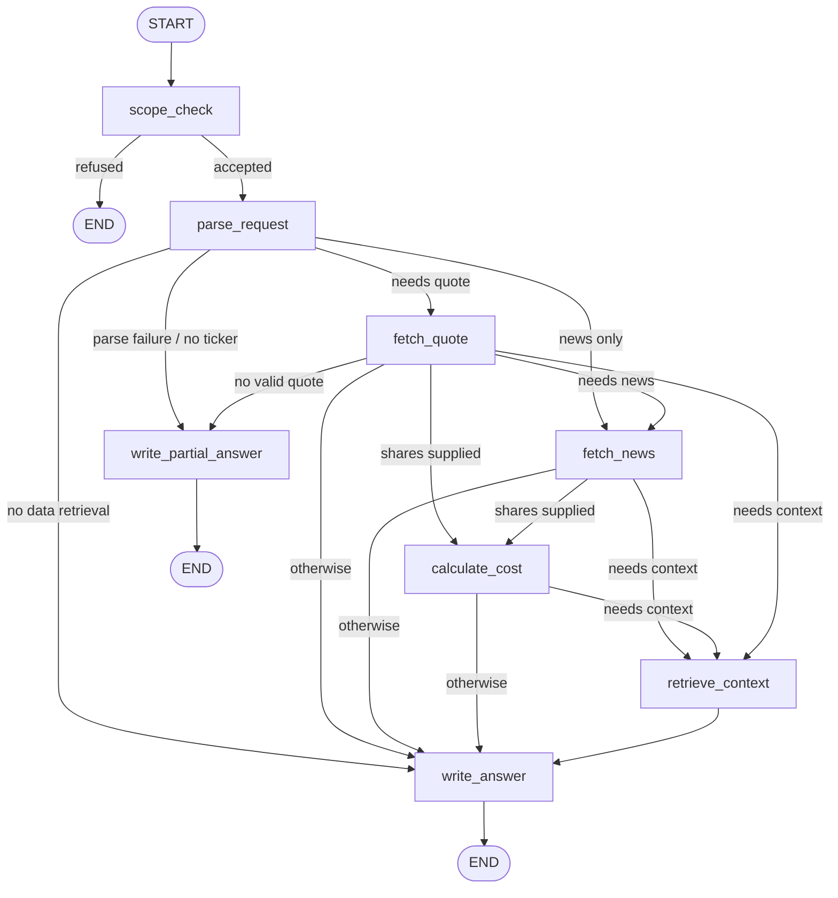

# Market Research Assistant — Version-One Product Note

## Project goal

> A command-line market-research assistant that accepts an equity research question, retrieves current or recent pricing, searches recent market news, calculates share costs, and returns a sourced informational answer.

## Implemented version-one scope

- One or more stock tickers.
- Latest available closing prices, with source, trading date, retrieval time, and freshness classification.
- Share-cost calculations for a supplied positive quantity.
- Recent finance-news retrieval with structured source information.
- Two-step RAG retrieval over a small local Markdown knowledge base.
- Reference-source labels and grounded reference evidence in answer generation.
- Scope guardrails for trade execution, unrelated questions, and personalized investment advice.
- Partial answers when parsing, quote retrieval, news retrieval, or model generation fails.
- Graph-step streaming and hybrid answer streaming in the command-line interface.
- Tests that mock external services and model behavior.

Deferred: portfolios, trading, databases, dashboards, and conversation memory.

## Current technology

- Python 3.11+
- LangGraph
- LangChain Core and `langchain-openai`
- `langchain-text-splitters`, `langchain-huggingface`, and `sentence-transformers`
- OpenAI-compatible model endpoint
- `yfinance`
- Tavily
- `python-dotenv`

## Workflow



Nodes perform work; conditional edges determine which node runs next. The parser controls whether price retrieval, news retrieval, and share-cost calculation are needed.

## State

```text
question
intent
ticker
shares
needs_quote
needs_news
needs_context
quote
news
news_status
context
context_status
calculation
errors
final_answer
steps
```

`quote` holds one structured quote per ticker. Each quote includes price, currency, price type, trading date, retrieval time, freshness status, and source. `news` contains structured article fields: title, publisher, publication timestamp, URL, and content excerpt. RAG context is limited to the highest-scoring chunks that pass the configured relevance threshold; each chunk retains its retrieval score in metadata.

## Component responsibilities

| Component | Responsibility |
| --- | --- |
| `guardrails.py` | Scope validation and refusals. |
| `parser.py` | Structured LLM parsing plus deterministic validation. |
| `data.py` | Quote/news retrieval, timestamps, freshness, and source normalization. |
| `calculations.py` | Exact share-cost arithmetic and input validation. |
| `graph.py` | Nodes, state updates, conditional routing, RAG retrieval, and partial-answer fallbacks. |
| `rag.py` | Markdown loading, chunking, local embeddings, vector storage, and similarity retrieval. |
| `answer.py` | Trusted section formatting, quote/news/reference grounding, prompt-injection defense, and narrative streaming. |
| `cli.py` | User input, graph execution, and terminal output. |

## Trust model

- Calculations and output structure are deterministic Python code.
- Price data is external market data and is labelled with its source and freshness.
- News content is untrusted evidence, not instructions.
- The model parses requests and writes constrained narrative summaries; its output is validated or surrounded by deterministic application formatting.

## Streaming model

The CLI receives two kinds of LangGraph events:

```text
Graph state updates → “fetch_quote completed”
Custom events       → answer headings and model text as it arrives
```

`answer.py` sends text chunks through LangGraph's stream writer. The CLI prints each chunk immediately and the full assembled result remains available as `final_answer` in graph state.
