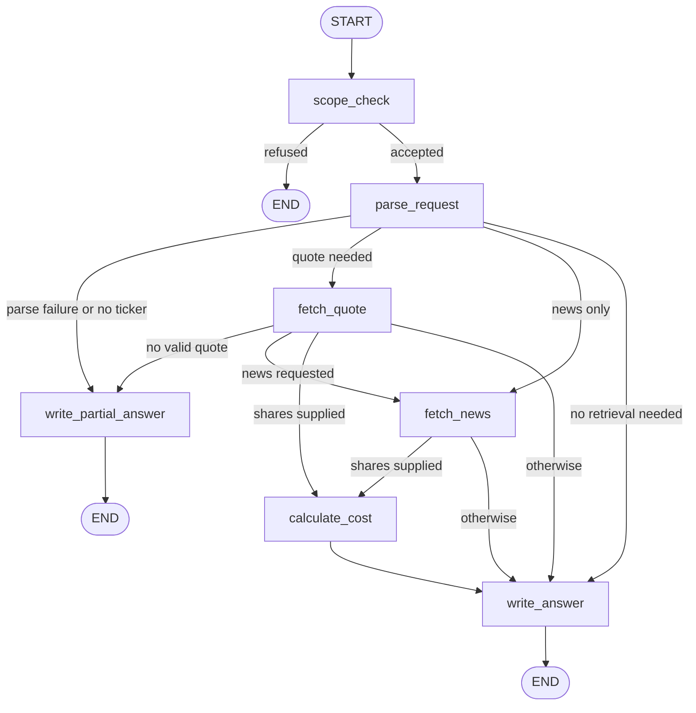

# Market Research Assistant

A command-line application for sourced, informational equity-market research. It retrieves the latest available closing prices, searches recent news, calculates estimated share costs, and presents the result with sources, timestamps, freshness information, and an investment-advice disclaimer.


## What it does

- Interprets one or more ticker symbols and an optional share quantity from a natural-language question.
- Retrieves the latest available closing price from Yahoo Finance through `yfinance`.
- Searches finance news through Tavily, preferring the past day and falling back to the past week when results are sparse.
- Retrieves relevant stable reference context from the local RAG knowledge base when a question asks for company or industry background.
- Calculates share costs deterministically in Python.
- Labels price type, trading date, retrieval time, source, and freshness.
- Separates verified quote data from reported news and model-written summaries.
- Refuses trade execution, unrelated requests, and personalized investment-advice requests.
- Streams workflow progress and answer text in the terminal.

## Architecture

```text
CLI question
  ↓
LangGraph workflow
  ↓
scope check → structured parsing → quote/news retrieval → calculation → answer
  ↓
terminal progress updates + streamed answer text
```

The graph coordinates the work. External retrieval, RAG retrieval, and arithmetic remain ordinary Python functions, independent of the language model.

The current RAG path is a predictable two-step flow:

```text
Question → retrieve relevant reference chunks → grounded answer
```

The initial knowledge base is stored in `knowledge/` as Markdown. The retriever uses local embeddings and an in-memory vector store; the index is rebuilt when the process starts. It returns at most the two highest-scoring chunks and filters out chunks below a relevance threshold.



## Technology

- Python 3.11+
- LangGraph
- LangChain Core and `langchain-openai`
- `langchain-text-splitters` and `langchain-huggingface`
- `sentence-transformers` for local document embeddings
- An OpenAI-compatible model endpoint (currently configured for OpenCode Go)
- `yfinance`
- Tavily
- `python-dotenv`

## Setup

Create and activate a virtual environment, then install the project in editable mode:

```bash
python3.12 -m venv .venv
source .venv/bin/activate
pip install -e .
```

Create a `.env` file in the project root. Never commit this file.

```dotenv
TAVILY_API_KEY=your_tavily_key
OPENCODE_API_KEY=your_opencode_key
OPENCODE_BASE_URL=https://opencode.ai/zen/go/v1
OPENCODE_MODEL=deepseek-v4-flash
```

The model endpoint and model name are configurable so the application can later use another compatible provider without changing workflow code.

## Usage

After installation, run either form:

```bash
market-research "What was the latest available closing price of NVDA, how much would 8 shares cost, and what recent news was reported?"
```

```bash
python -m market_research.cli "Compare AAPL and MSFT prices."
```

Running `market-research` with no question starts an interactive prompt.

## Output design

Python renders predictable, data-sensitive sections:

- Summary
- Quotes
- Estimated share cost, when shares are requested
- Recent news and source links
- Reference sources, when RAG context is used
- Data limitations
- Disclaimer

The language model writes only the narrative summary and news summaries. Quotes, sources, arithmetic, timestamps, and disclaimers are rendered by application code. News excerpts are treated as untrusted data and explicitly delimited in the model prompt; instructions inside articles are ignored.

## Testing

Run the test suite with:

```bash
python -m pytest -q
```

External services are mocked in the normal tests, so they are fast, deterministic, and do not consume Yahoo, Tavily, or model API requests.

## Current limitations

- Prices are latest available closes, not guaranteed live prices.
- Yahoo Finance and Tavily data can be delayed, incomplete, or unavailable.
- The initial RAG corpus is small and local; its vector index is not yet persisted.
- Hugging Face authentication is currently optional; configure `HF_TOKEN` later
  if higher rate limits or more reliable embedding-model downloads are needed.
- The RAG retriever currently uses Markdown documents; PDF and automated document ingestion are future work.
- The first version has no portfolios, trade execution, database, dashboard, or conversation memory.
- The assistant does not provide personalized buy/sell recommendations. (YET)
